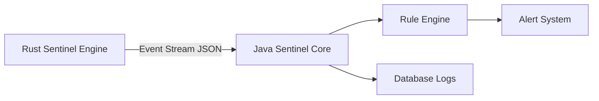

# 🛡️ Sentinel

A hybrid security monitoring and anomaly detection system built with **Rust + Java**.

---

## 🚧 Status

> ⚠️ **UNDER CONSTRUCTION / COMING SOON**

Sentinel is currently in early development. Core architecture is being designed and implemented.

---

## 🧠 Overview

Sentinel is a modular security system designed to monitor, analyze, and detect suspicious system or network activity in real time.

It is built using a two-layer architecture:

* ⚡ **Rust Engine** → Fast real-time event detection
* ☕ **Java Core** → Event processing, storage, and rule-based analysis

---

## 🏗️ Architecture



---

## 🚀 Planned Features

### Rust Engine

* Real-time event monitoring
* Network / system activity detection
* Fast anomaly scoring
* Lightweight event streaming

### Java Core

* Event ingestion API
* Rule-based detection system
* Logging and persistence
* Optional dashboard / visualization layer

---

## 📦 Project Goals

* Build a lightweight intrusion detection system (IDS)
* Combine Rust performance with Java structure
* Enable modular security monitoring
* Provide extensible rule-based analysis engine

---

## ⚠️ Current Status

```text
[█████░░░░░░░░░░░░] 25% Complete
```

* Architecture design: ✅
* Rust engine: 🚧 In progress
* Java core: 🚧 Planned
* Integration: 🚧 Planned
* UI/Dashboard: ❌ Not started

---

## 🔧 Tech Stack

* Rust (systems-level detection engine)
* Java (Spring Boot / backend logic layer)
* JSON (event communication format)
* Optional: SQLite / PostgreSQL for storage

---

## 📌 Future Improvements

* Real-time dashboard
* Advanced anomaly scoring system
* Machine learning-based detection (later stage)
* Packet-level network inspection
* Alert notifications (CLI / email / webhook)

---

## 🧪 Example Event Flow

```text
Rust Engine detects event
        ↓
Converts to JSON
        ↓
Sends to Java Core
        ↓
Java analyzes rules
        ↓
Logs or triggers alert
```

---

## ⚠️ Disclaimer

Sentinel is intended for educational and research purposes only.
Use only on systems and networks you own or have permission to monitor.

Unauthorized monitoring or scanning may violate laws or policies.

---

## 🚧 Coming Soon

* First stable Rust detection module
* Java API endpoint system
* Basic rule engine implementation
* Initial CLI output interface

---

